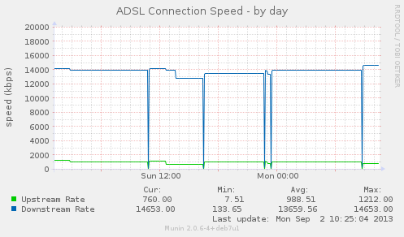

munin BrightBox plugin
======================

I own a BrightBox router, and wanted to know what connection speeds I was
getting.  This simple munin plugin lets me see that.

Installation Instructions
-------------------------

Do the following::

    git clone https://github.com/OddBloke/brightbox-munin.git
    cd brightbox-munin
    sudo cp brightbox.sh /etc/munin/plugins/brightbox
    sudo /etc/init.d/munin-node restart

Example Output
--------------

Some example munin graphs (each taken from different times).

Day
~~~

Week
~~~~

.. image:: https://d2weczhvl823v0.cloudfront.net/OddBloke/brightbox-munin/trend.png
   :alt: Bitdeli badge
   :target: https://bitdeli.com/free

